# Scrapbook Photo Collage Skill

> 把普通照片，变成值得收藏的纸感手账。

这是一个可移植的开源 Agent Skill，可以把 1–8 张日常照片变成有氛围、有细节、也更有故事感的纸感手账。旅行、聚会、约会、美食、宠物或某个普通周末，都可以被整理成值得收藏和分享的一组作品。

> **早期版本说明：** 目前仅完成了 **Codex** 环境测试。现阶段推荐在提供 ImageGen 的 Codex 中使用，工作流仍在持续完善。

## 为什么值得试试？

- **让随手拍更有作品感**：普通照片也能拥有完整的配色、标题和画面氛围。
- **让照片讲出自己的故事**：人物、地点、天气、食物和情绪会提供一部分设计灵感，同时保留自由联想的惊喜。
- **保留真实又增加趣味**：照片仍然清晰自然，周围可以出现纸张、手写字、票据、相机、唱片、书本、水果、咖啡、汽车模型和其他好玩的小物件。
- **一组照片自动变成完整系列**：既有适合单独发布的页面，也有适合作为封面或回顾的合辑。
- **适合直接分享**：统一的 3:4 竖版画面可用于小红书、Instagram、博客和个人相册。

上传照片后，Skill 默认会制作一套“故事感中密度”作品：单图和合辑都会在宽阔的摄影感天空、柔和云层、温暖地平线与低处远树剪影前，放置一个边界清楚、层次集中的手作故事岛。纸张和布料留在前景拼贴中，不再铺成平闷的整幅底色。真实照片、醒目英文标题、短日记与有趣小物自然交叠。1 张照片会变成 1 张完整手账；2–8 张照片会得到每张照片的独立页面，以及 1 张串联全部回忆的合辑。所有成品统一为 **3:4 竖版比例**。外部场景只是装饰氛围，不改变原照片的地点、光线和内容。

v1.9 将 `examples/after/08-open-sky-stage.png` 随包提供，作为单页和合辑共同的主要风格参考。它不是额外的素材照片；新安装的 Skill 无需读取旧对话或补传参考图，也能获得相同的视觉基线。下方旧示例主要展示材质工艺，其中的平面底色不是当前默认背景。

## 风格名称：纸感照片手账

我们把这种风格称为 **纸感照片手账**：以真实照片为主体，结合撕边纸张、半透明硫酸纸、布料、带褶皱的胶带、手写标题、票据、地图、便签和少量纪念物，形成像亲手剪贴出来的故事页面。

Skill 会从照片中的人物、地点、颜色、天气、活动与情绪寻找一部分灵感，同时保留大约一半自由联想的收藏小物。海滨照片可以延伸出潮汐卡、浪花硫酸纸和海岸地图，也可以加入相机、水果、指南针、收音机或迷你帆船；温暖的室内时光除了布料、便签和窗边光影，也可以出现打开的书、咖啡杯、唱片、汽车模型或其他有趣物件。装饰物不必全部与照片内容一一对应，这样每页才不会变得机械和模板化。

成品中的装饰标题和短日记**默认使用英文**，让画面更像轻盈的编辑手账；只有当用户明确提出其他语言时才会切换。

这种风格既可以清新、安静、可爱和浪漫，也可以具有杂志感或怀旧感，不会把所有故事都强行做成泛黄旧纸。照片始终清晰、可辨，并作为情绪锚点；标题、短日记、触感材料与纪念小物共同把整页变成一个小型故事世界。

## 可以用在哪些场景？

- **旅行与城市漫步**：旅行封面、目的地日记、公路旅行、周末记录和多地点回忆板。
- **咖啡馆、美食与餐厅**：探店记录、约会晚餐、喜欢的菜、咖啡日记和美食旅行总结。
- **朋友、情侣与家人**：生日、纪念日、友情记录、家庭相册和月度照片回顾。
- **宠物生活**：宠物写真、领养纪念、生日、日常片段和纪念页面。
- **博物馆、展览、书籍与电影**：观展记录、阅读手账、文化一日游和个人收藏整理。
- **成长节点与四季记录**：毕业、搬家、新工作、节日、年度总结和“最近的生活”。
- **社交媒体内容**：小红书、Instagram、博客、Newsletter 或个人作品集的封面与多图轮播。

## 示例：六张照片生成一套完整手账

同一组 6 张原图会生成 6 张分别设计的单图作品，以及 1 张包含全部原图的总结拼贴。Skill 会保持照片主体清晰可辨，同时根据每张照片的题材改变配色、材质、手写字和装饰物。

<p align="center">
  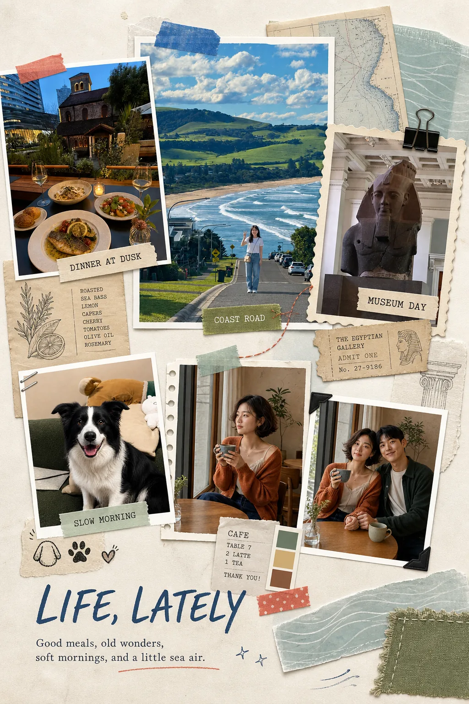
</p>

<p align="center"><strong>六个生活片段，汇成一页完整的「最近生活」</strong></p>

<table>
  <thead>
    <tr>
      <th width="50%">原始照片</th>
      <th width="50%">单图手账成品</th>
    </tr>
  </thead>
  <tbody>
    <tr>
      <td>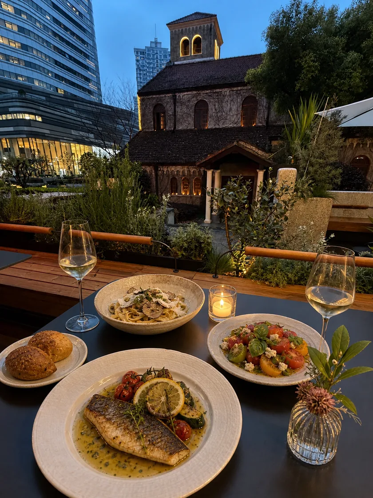</td>
      <td>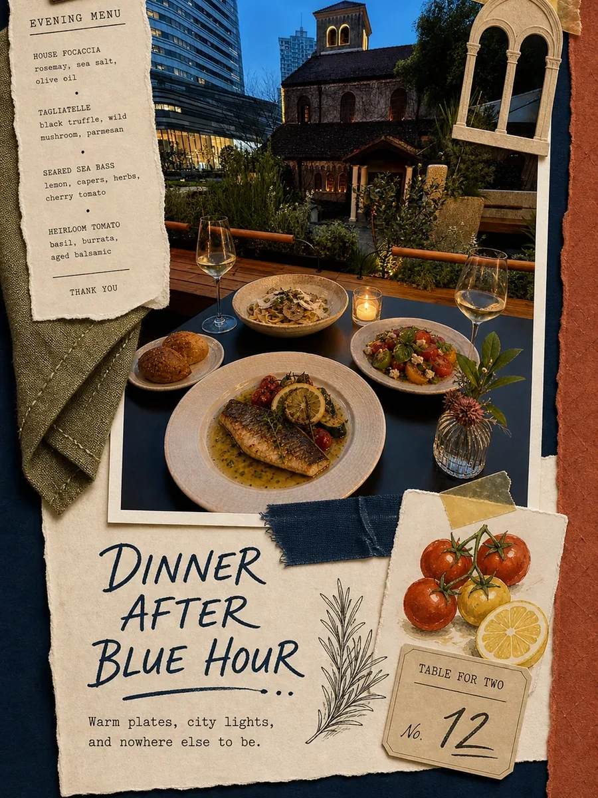</td>
    </tr>
    <tr>
      <td>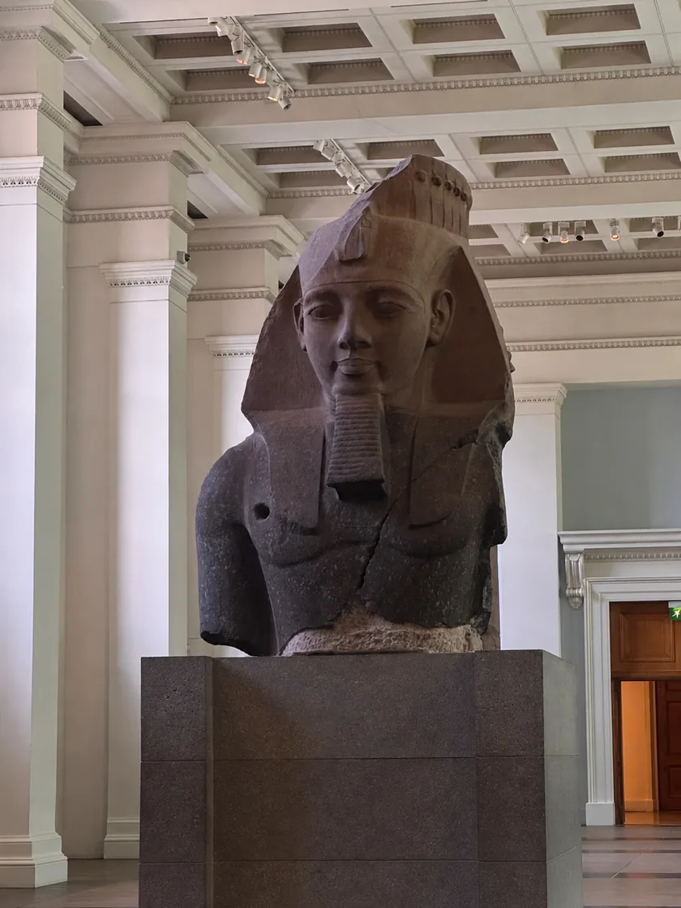</td>
      <td>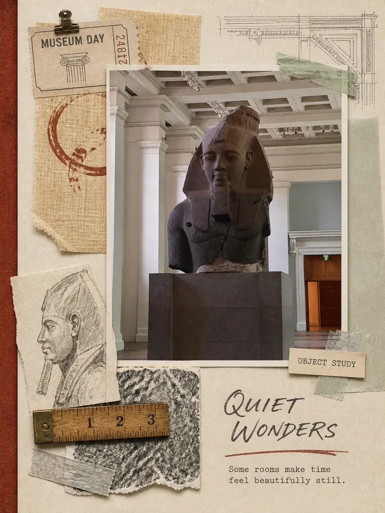</td>
    </tr>
    <tr>
      <td>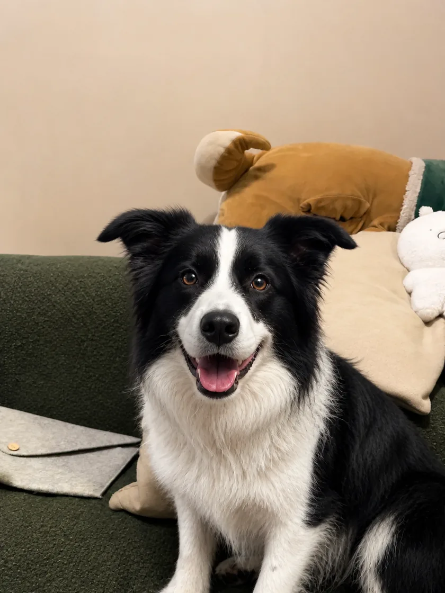</td>
      <td>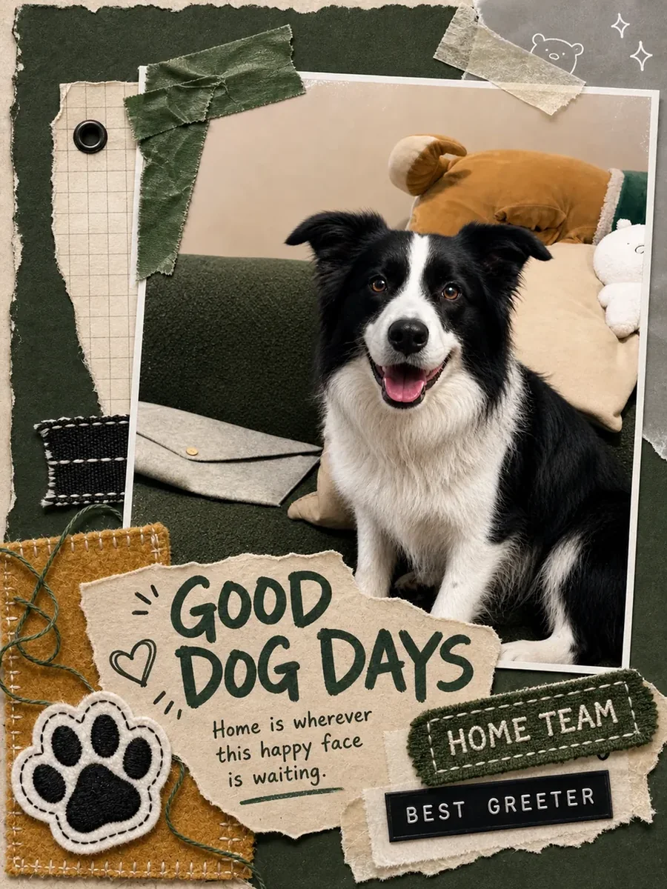</td>
    </tr>
    <tr>
      <td>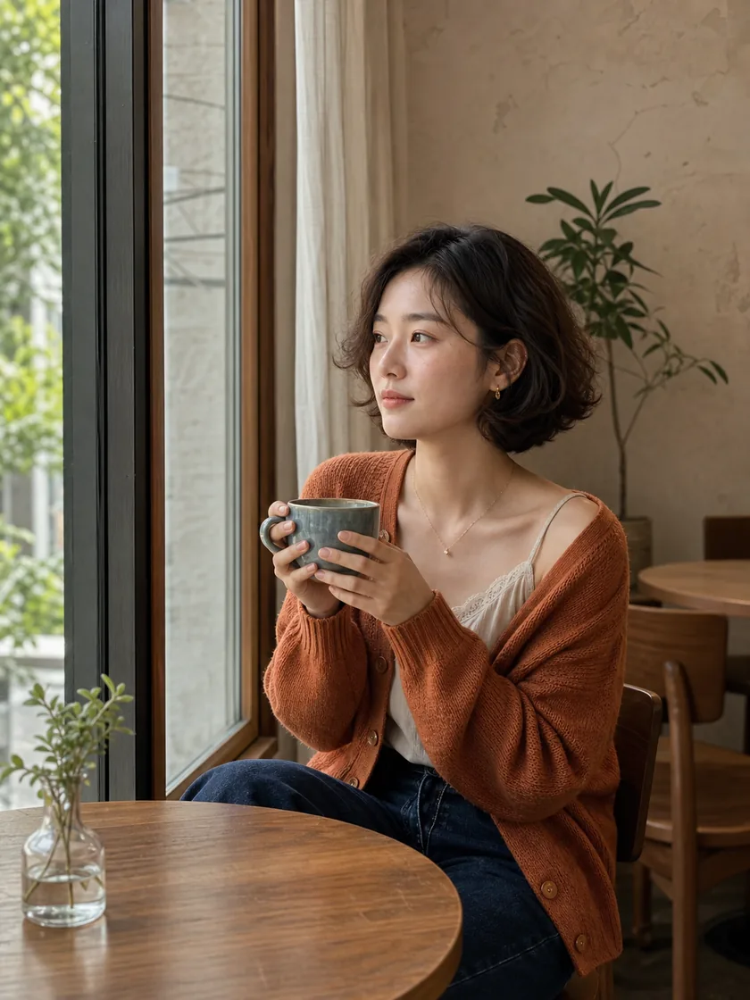</td>
      <td>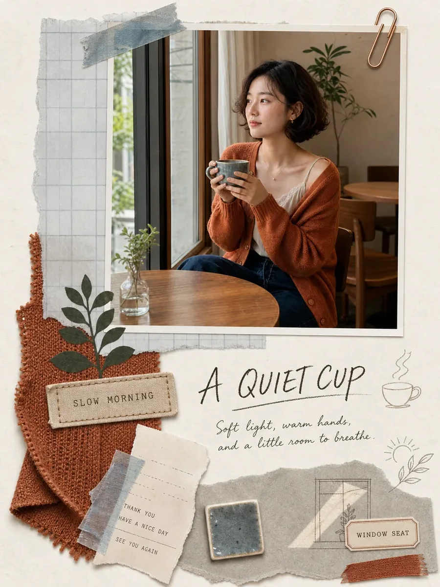</td>
    </tr>
    <tr>
      <td>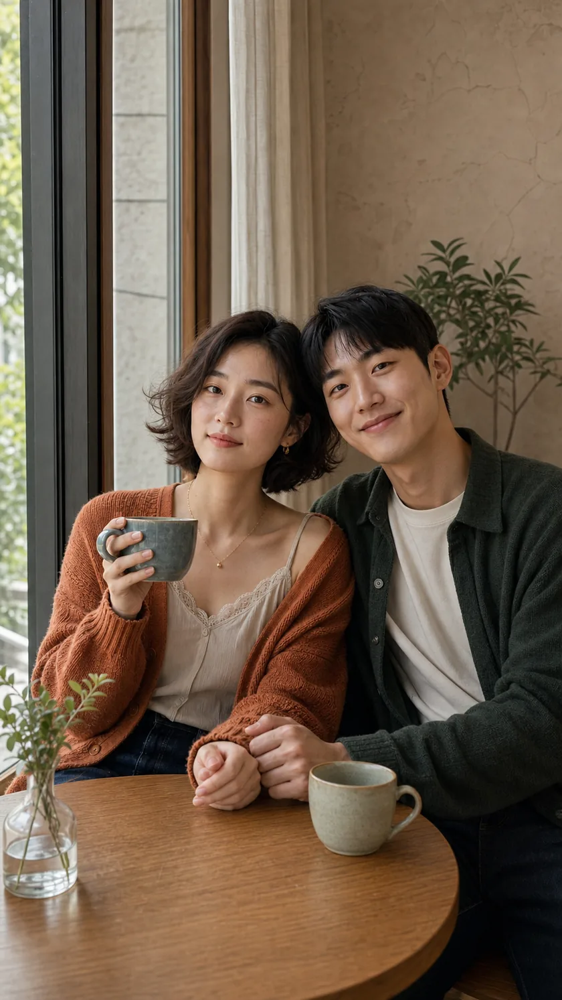</td>
      <td>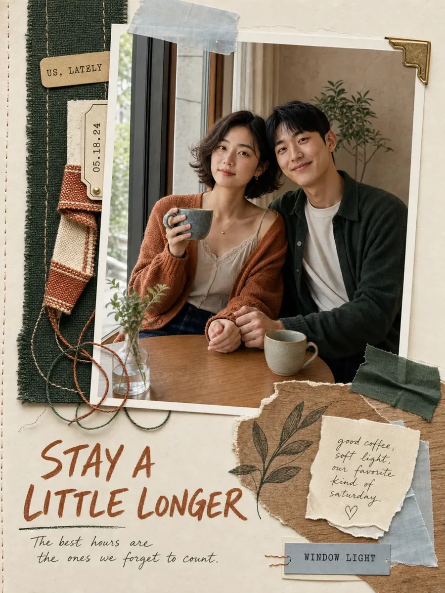</td>
    </tr>
    <tr>
      <td>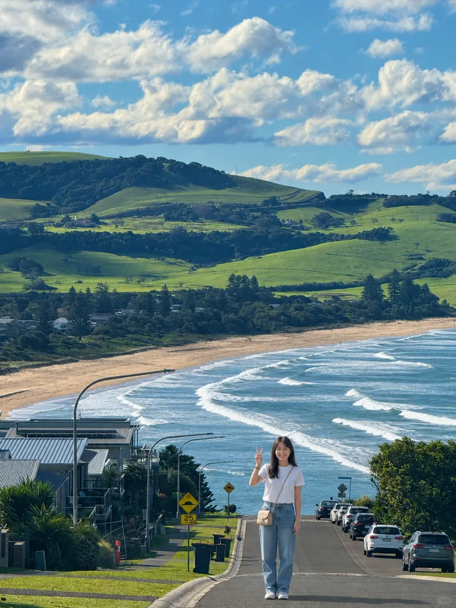</td>
      <td>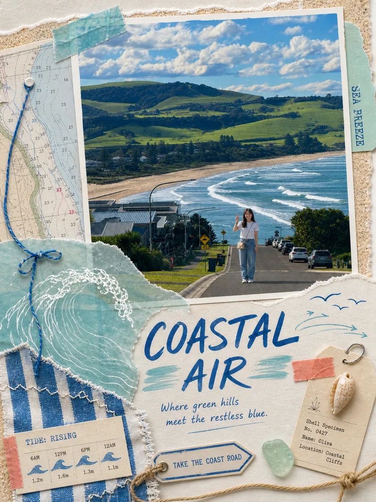</td>
    </tr>
  </tbody>
</table>

## 能力要求

这是一个早期版本，目前仅在 **Codex** 中完成测试，现阶段推荐使用提供 ImageGen 的 Codex 界面。最终图片需要参考图生图或改图能力；如果当前 Codex 界面没有可用的图片工具，Skill 仍可输出构图方案和渲染 Prompt，但不能直接完成最终手账图片。

Python 3 与 Pillow 是可选依赖。除了生成带编号的无裁切素材索引图，它们还能启用更稳妥的保真模式：先单独生成手账背景与装饰，再把未经重绘的原图嵌入相框，避免能力较弱的模型删掉人物、宠物或场景。

## 安装

克隆仓库后，为 Codex 安装：

```bash
python3 scripts/install_skill.py --target codex
```

安装脚本会把 Skill 复制到 `~/.codex/skills/scrapbook-photo-collage/`。安装完成后，请新建一个 Codex 任务，让最新版本在干净上下文中被发现。

## 使用示例

> 使用 scrapbook-photo-collage Skill，把我上传的八张旅行照片做成一套 3:4 手账作品：每张照片各生成一张，最后再生成一张八图总结拼贴。人物保持一致，成品文案使用英文，在手账岛外围保留明显的大背景，并把照片相关细节与自由联想的有趣小物混合使用。

## 隐私

仓库仅在 `examples/` 中包含项目作者授权用于展示的示例照片。Skill 本身不会自行上传图片，实际图片由你选择的 Agent 与生图服务处理。

## 许可证

[MIT](LICENSE)
